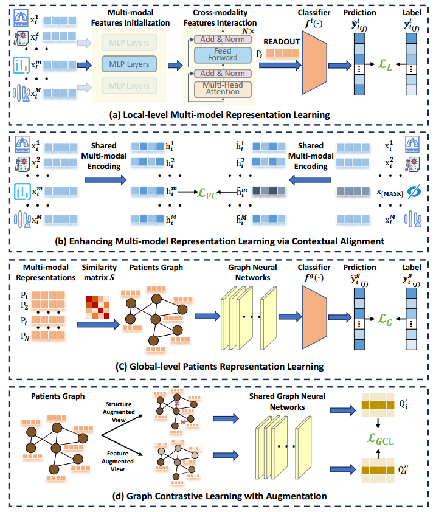

# Multi-modal Disease Prediction with Hierarchical Self-supervised Learning（HierSSL）

>🌟 If you find this resource helpful, please consider to star this repository and cite our research:

```
@ARTICLE{10966034,
  author={Qu, Zhe and Chen, Taihua and Zhou, Xin and Zhu, Fanglin and Guo, Wei and Xu, Yonghui and Zhang, Yixin and Cui, Lizhen},
  journal={IEEE Journal of Biomedical and Health Informatics}, 
  title={Multi-modal Disease Prediction with Hierarchical Self-supervised Learning}, 
  year={2025},
  volume={},
  number={},
  pages={1-12},
  keywords={Diseases;Representation learning;Feature extraction;Medical diagnostic imaging;Data models;Adaptation models;Data mining;Contrastive learning;Training;Magnetic resonance imaging;Disease prediction;Multi-modal medical data;Self-supervised Learning},
  doi={10.1109/JBHI.2025.3561546}}

```

## Introduction

We present **HierSSL**, a novel end-to-end **Hierarchical Self-supervised Learning** framework for disease prediction with multi-modal biomedical data. This repository provides the official PyTorch implementation of HierSSL, including training scripts, pretrained models, and evaluation utilities.

In the healthcare domain, multi-modal data collected from diverse sources—such as MRI, CT, blood biomarkers, and clinical reports—offer a comprehensive view of a patient’s physiological and pathological state. Effectively leveraging this heterogeneous information is critical for building robust Computer-Aided Diagnosis (CAD) systems. While recent Graph Neural Network (GNN)-based methods have achieved notable performance by modeling patient similarities over population graphs, they often suffer from noise interference, low-quality modality contributions, and over-smoothed graph structures due to inappropriate constraints.

To address these challenges, **HierSSL** introduces a **two-level self-supervised representation learning** paradigm:
- At the **local modality level**, HierSSL performs modality-aware fusion via a contextual inference task that promotes inter-modality consistency and resilience to noisy or missing modalities.
- At the **global patient level**, HierSSL utilizes a contrastive graph learning strategy to preserve fine-grained patient-level distinctions and maintain a robust dynamic graph topology.

Key contributions of HierSSL include:
- A **hierarchical self-supervised learning framework** that improves both intra-modal and inter-patient representation quality.
- A **masked contextual learning strategy** to mitigate the impact of low-quality or missing modalities.
- A **graph contrastive objective** that strengthens the graph structure by preserving patient-specific characteristics and reducing error link rates.
- **Extensive experiments** on two public disease prediction benchmarks (TADPOLE and ABIDE) demonstrate the superior performance of HierSSL compared to state-of-the-art baselines.

We hope HierSSL can serve as a flexible and powerful baseline to support further research on multi-modal representation learning and adaptive graph modeling for biomedical applications.

For more technical details, please refer to our paper available at [IEEE Xplore](https://ieeexplore.ieee.org/document/10966034).



*Figure: Overview of the proposed HierSSL framework.*

## Code Running

### Step 0: Env setup

Use python 3.6 from MiniConda

```bash
conda env create -f environment.yml
conda activate HierSSL
```

### Step 1: Data prprocessing

-  All the preprocessed data are provided in  ./data/{dataset}
- （Opt）If you want to start processing the data from scratch，runn the code of data preprocessing in ./data/{dataset} to preprocess the raw data to standard data as the input of HierSSL.

### Step 2: Training and test

Running 
```
./{dataset}-Graph-test.sh
```

Notice: the sh file is used to reproduce the result reported in our paper, you could also run this script to train and test your own dataset:
```
python main.py
```
Besides, you can modify 'network.py' to establish a variant of HierSSL and 'model.py' to try and expolre a better training strategy for other tasks.

## Acknowledgements

We sincerely thank [SsGood/MMGL: Multi-modal Graph learning for Disease Prediction (IEEE Trans. on Medical imaging, TMI2022)](https://github.com/SsGood/MMGL)for their open-source project, which provided essential code support and inspiration for this work.
